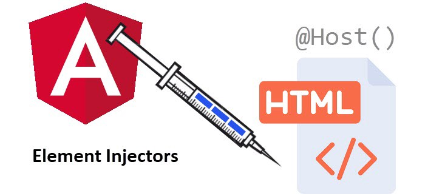
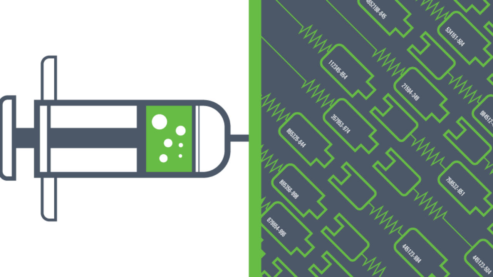
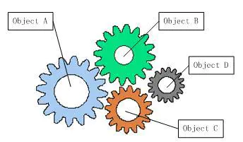
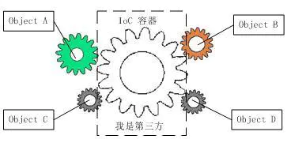

# Angular DI

### Angular 依赖注入主题的分享

#### 分享人：刘文杰

#### 分享日期：2020-12

---




# 目录
##### 1. 什么是依赖注入？
##### 2. 从Angular Service入手
##### 3. Angular Injectors
##### 4. ModuleWithProviders
##### 5. Talk is cheap, show me the code

---

# 第一节 什么是依赖注入？

**依赖注入（Dependency Injection）是一种设计模式。**
**DI的核心就是类从外部源请求依赖而不是直接创建它们。**
**您可以使用Angular DI来增加应用程序的灵活性和模块化。**

```typescript
@Component{
  selector: 'test-foo',
  templateUrl: './test-foo.html',
}
export class FooComponent {

  constructor(
      private readonly fooService: FooService) {

  }

}
```

---




# 控制反转 (IOC)

- 对象A依赖于对象B，那么对象A在初始化或者运行到某一点的时候，自己必须主动去创建对象B或者使用已经创建的对象B。无论是创建还是使用对象B，控制权都在自己手上。

- 由于IOC容器的加入，对象A与对象B之间失去了直接联系，所以，当对象A运行到需要对象B的时候，IOC容器会主动创建一个对象B注入到对象A需要的地方。


*[IOC]: Inversion of Control

---

# 第二节 从Service入手，逐步深入Angular的DI机制

### 1.1 ValueProvider、ClassProvider、ExistingProvider、FactoryProvider
### 1.3 InjectionToken
### 2.1 @Inject装饰器
### 2.2 如何通过injector动态获取provider

---

# ValueProvider

配置注入器以返回令牌的值。

```typescript
interface ValueProvider extends ValueSansProvider {
  provide: any
  multi?: boolean

  // inherited from core/ValueSansProvider
  useValue: any
}
```

---

# ConstructorProvider

```typescript
interface ConstructorProvider extends ConstructorSansProvider {
  provide: Type<any>
  multi?: boolean

  // inherited from core/ConstructorSansProvider
  deps?: any[]
}
```

---

# StaticClassProvider

```typescript
interface StaticClassProvider extends StaticClassSansProvider {
  provide: any
  multi?: boolean

  // inherited from core/StaticClassSansProvider
  useClass: Type<any>
  deps: any[]
}
```

---

# ClassProvider

```typescript
interface ClassProvider extends ClassSansProvider {
  provide: any
  multi?: boolean

  // inherited from core/ClassSansProvider
  useClass: Type<any>
}
```

---

# ExistingProvider

```typescript
interface ExistingProvider extends ExistingSansProvider {
  provide: any
  multi?: boolean

  // inherited from core/ExistingSansProvider
  useExisting: any
}
```

---

# FactoryProvider

```typescript
interface FactoryProvider extends FactorySansProvider {
  provide: any
  multi?: boolean

  // inherited from core/FactorySansProvider
  useFactory: Function
  deps?: any[]
}
```

---

# Angular Injectors

Angular中有两个注入器层次结构

### 1. ElementInjector 层级

_默认在每个DOM上隐式创建(Created implicitly at each DOM element)_。如果我们没有在`Component`或者`Directive`上面声明`Providers`，那么`ElementInjector`默认是空的

### 2. ModuleInjector 层级

使用`@Injectable`装饰器或者在`@NgModule`的`providers`数组中可以在`ModuleInjector`层级中创建`Provider`

---

# ElementInjector

Angular为每个DOM元素隐式创建ElementInjector。

在`@Component`或`@Directive`装饰器的`providers`或者`viewProviders`数组中声明的`Provider`位于当前`Component`的`ElementInjector`中。

_当组件实例被销毁时，该服务实例也将销毁。_
_同一元素上的Component和Directive共享一个ElementInjector。_

#### Providers And ViewProviders

`viewProviders` limits the provider to children other than projected content, while `providers` allows all children to use the provider.
The value is that `viewProviders` allows you to prevent projected content from messing with your services, which could be especially useful in libraries.

---

# ModuleInjector

以下两种方式可以在`ModuleInjector`层级创建Provider：

- 使用`@Injectable`装饰器并在`providedIn`属性中引用一个`NgModule`
- 在`@NgModule`装饰器的`providers`数组中声明

---

## Tree-shaking and @Injectable()
Using the @Injectable() providedIn property is preferable to the @NgModule() providers array because with @Injectable() providedIn, optimization tools can perform tree-shaking, which removes services that your app isn't using and results in smaller bundle sizes.

Tree-shaking is especially useful for a library because the application which uses the library may not have a need to inject it.

ModuleInjector is configured by the @NgModule.providers and NgModule.imports property. ModuleInjector is a flattening of all of the providers arrays which can be reached by following the NgModule.imports recursively.

Child ModuleInjectors are created when lazy loading other @NgModules.

---

# ModuleWithProviders

---

# Talk is cheap, show me the code!

代码演示阶段部分

---

# 谢谢您的观看！

我的分享结束啦
