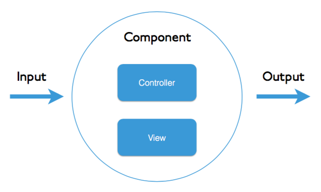

# Angular的Service及组件通讯

#### 分享人：刘文杰

#### 分享日期：2021-01

---


# 目录
## 依赖注入部分
##### 1. 什么是依赖注入？
##### 2. 从Angular Service入手
##### 3. Angular Hierarchical Injectors
##### 4. @Self,@Host,@SkipSelf,@Optional
<!-- ##### 4. ModuleWithProviders -->

---



# 目录
## 组件通讯部分
##### 1. 组件间交换数据常见方式
##### 2. 父子组件之间如何交换数据
##### 3. 同级组件之间如何交换数据
##### 4. 跨级组件之间如何交换数据

---

# 第一节 什么是依赖注入？

**依赖注入（Dependency Injection）是一种设计模式。**
**DI的核心就是类从外部源请求依赖而不是直接创建它们。**
**您可以使用Angular DI来增加应用程序的灵活性和模块化。**

```typescript
@Component{
  selector: 'test-foo',
  templateUrl: './test-foo.html',
}
export class FooComponent {

  constructor(
      private readonly fooService: FooService) {

  }

}
```

---


# 控制反转 (IOC)

- 对象A依赖于对象B，那么对象A在初始化或者运行到某一点的时候，自己必须主动去创建对象B或者使用已经创建的对象B。无论是创建还是使用对象B，控制权都在自己手上。

- 由于IOC容器的加入，对象A与对象B之间失去了直接联系，所以，当对象A运行到需要对象B的时候，IOC容器会主动创建一个对象B注入到对象A需要的地方。


*[IOC]: Inversion of Control

---

# 第二节 从Service入手，逐步深入Angular的DI机制

### 1. ValueProvider、ClassProvider、ExistingProvider、FactoryProvider
### 2. InjectionToken
### 3. @Inject装饰器
### 4. 通过injector动态获取provider

---

# ValueProvider

配置注入器以返回令牌的值。

```typescript
interface ValueProvider extends ValueSansProvider {
  provide: any
  multi?: boolean

  // inherited from core/ValueSansProvider
  useValue: any
}
```

---

# ClassProvider

```typescript
interface ClassProvider extends ClassSansProvider {
  provide: any
  multi?: boolean

  // inherited from core/ClassSansProvider
  useClass: Type<any>
}
```

---

# ExistingProvider

```typescript
interface ExistingProvider extends ExistingSansProvider {
  provide: any
  multi?: boolean

  // inherited from core/ExistingSansProvider
  useExisting: any
}
```

---

# FactoryProvider

```typescript
interface FactoryProvider extends FactorySansProvider {
  provide: any
  multi?: boolean

  // inherited from core/FactorySansProvider
  useFactory: Function
  deps?: any[]
}
```

---

# Angular Injectors

Angular中有两个注入器层次结构

### 1. ElementInjector 层级

_默认在每个DOM上隐式创建(Created implicitly at each DOM element)_。如果我们没有在`Component`或者`Directive`上面声明`Providers`，那么`ElementInjector`默认是空的

### 2. ModuleInjector 层级

使用`@Injectable`装饰器或者在`@NgModule`的`providers`数组中可以在`ModuleInjector`层级中创建`Provider`

---

# ElementInjector

Angular为每个DOM元素隐式创建ElementInjector。

在`@Component`或`@Directive`装饰器的`providers`或者`viewProviders`数组中声明的`Provider`位于当前`Component`的`ElementInjector`中。

_当组件实例被销毁时，该服务实例也将销毁。_
_同一元素上的Component和Directive共享一个ElementInjector。_

#### Providers And ViewProviders

`viewProviders`限制provider仅在子元素中可用，在插入内容（ng-content）中不可用。
`viewProviders`会屏蔽插入的内容，因此在开发library的时候非常有用，这可以减少library对内容的干扰。

---

# ModuleInjector

以下两种方式可以在`ModuleInjector`层级创建Provider：

- 使用`@Injectable`装饰器并在`providedIn`属性中引用一个`NgModule`
- 在`@NgModule`装饰器的`providers`数组中声明

在一个层级的ModuleInjector中，所有providers都是被平铺的。

注意：组件中注入Provider时的查找顺序是从使用的地方开始，而不是声明的地方。

> If Angular doesn't find the provider in any ElementInjectors,
> it goes back to the element where **the request originated** and looks in the ModuleInjector hierarchy.

---

## Tree-shaking and @Injectable()

更加推荐使用`@Injectable()`配合`providerIn`来创建Service，因为使用这种方式创建的Service便于构建优化代码。
这种方式，没有被inject的Service是不存在文件引用关系的，因此构建工具可以去除没有用到的代码来减少构建包的体积。

tip: 此处我不确定它是否有用，因为使用injector仍可注入，目测无法tree-shaking。

**此处Angular目前仍未完善，如果使用providerIn引用NgModule会出错，相关issues：https://github.com/angular/angular/issues/25784**

---

### @Self
限制到当前ElementInjector

### *@Host
限制到当前视图边界，限制到当前模板？
- https://indepth.dev/posts/1063/a-curious-case-of-the-host-decorator-and-element-injectors-in-angular

### @SkipSelf
跳过当前ElementInjector

### @Optional
如果无法解析，那么定向到`NullInjector`

---


---

# ModuleWithProviders

```typescript
export class ConfigurableModule {

  public static register(options: ConfigurableModuleOptions): ModuleWithProviders<ConfigurableModule> {
    return {
      ngModule: ConfigurableModule,
      providers: [
        {
          provide: CONFIGURABLE_MODULE_OPTIONS,
          useValue: options,
        },
      ],
    };
  }

}
```

---

# 组件间交换数据常见方式

- 通过`@Input`和`@Output`
- 父组件通过`ViewChild`或者`ViewChildren`等方式
- 借助Service或者其他方式间接通信
- 通过inject parent component通信

---

# Talk is cheap, show me the code!

代码演示阶段部分

---

# 谢谢您的观看！

我的分享结束啦
